<p align="center">
  
</p>

<h1 align="center">pipeline-agents</h1>

<p align="center">
  <b>Give it data and a goal. Get a pandas/sklearn pipeline, with a record of every plan, check and repair.</b><br>
  Four agent roles, three memory stores, one consumer GPU — and a single-agent baseline that beat the team.
</p>

<p align="center">
  <a href="https://mazenddr.github.io/pipeline-agents/"><b>Field guide</b></a> (every part explained)
  &nbsp;·&nbsp;
  <a href="https://mazenddr.github.io/pipeline-agents/tour/"><b>The tour</b></a> (one run, start to finish)
  &nbsp;·&nbsp;
  <a href="https://mazenddr.github.io/pipeline-agents/field-test/"><b>Field test</b></a> (six recorded runs on fresh data)
</p>

---

## Results at a glance

| | |
|---|---|
| **Structure** | Success on eight held-out tasks, three seeds each: **0.88 single agent vs 0.50 team**. Paired difference +0.38 [0.04, 0.71]. The simpler system won this comparison. |
| **Memory** | All three stores together reached **0.71**, up from 0.50. The paired interval includes zero; this benchmark does not establish that memory helps. |
| **Critic** | Agreement with reference labels: **κ 0.30 [0.04, 0.54]**, across 50 reviewed verdicts. Confidence was not a reliable substitute for checking artifacts. |
| **Fresh data** | **6/6 runs passed** on wine quality, student grades and household power. The team used 8–9 times the model calls. One run per system and task. |
| **Compute** | Local open weights on one RTX 5060 Ti, 16 GB. No paid model API. Reported **shadow $** are token counts × pinned prices, not money spent. |

## How it works

<p align="center"></p>

1. **Profile.** Read the task, data dictionary, file formats and row counts. Retrieve semantic facts by file-schema fingerprint and episodes from similar tasks. [→ guide](https://mazenddr.github.io/pipeline-agents/#profile)
2. **Plan.** A Planner returns ordered steps with acceptance checks. The goal, profile, memory and failed plan are explicit inputs. [→ guide](https://mazenddr.github.io/pipeline-agents/#plan)
3. **Execute.** An Executor writes one step's Python file. On Linux, namespaces and resource limits isolate its data and output from the rest of the machine. [→ guide](https://mazenddr.github.io/pipeline-agents/#execute)
4. **Check and repair.** Deterministic tools inspect the output before a Critic judges it. A Reviser supplies repair instructions; exhausted repairs cause a re-plan, then a stop for a human. [→ guide](https://mazenddr.github.io/pipeline-agents/#check)
5. **Deliver.** Assemble accepted scripts into `pipeline.py`, rerun from a clean copy, and smoke-test predictions. The benchmark's hidden checker runs afterwards, outside the agent graph. [→ guide](https://mazenddr.github.io/pipeline-agents/#deliver)

Every graph node checkpoints one typed `RunState` to SQLite. Every model call passes through an Observer that records prompts, responses, tokens, latency and shadow cost. The baseline uses the same harness, sandbox and delivery checks, but writes the whole pipeline in each attempt.

## What the experiments found

### One model rewriting the whole pipeline beat four roles repairing pieces

<p align="center"></p>

The team's extra calls often bought a correct diagnosis without a workable repair. When `predict.py` expected features created by an earlier step, fixing the final step could not fix the file that caused the problem. The baseline could rewrite the whole program.

| Setup | Success [95% CI] | Calls | Shadow $ | Seconds |
|---|---|---:|---:|---:|
| Single agent | 0.88 [0.67, 1.00] | 1.8 | 0.0016 | 153 |
| Team · all memories | 0.71 [0.46, 0.92] | 20.9 | 0.0093 | 363 |
| Team · no memory | 0.50 [0.21, 0.79] | 23.0 | 0.0097 | 373 |

Comparisons are paired on task and seed, with a nested bootstrap over tasks and seeds. The baseline's lead over the all-memory team is uncertain (+0.17 [-0.17, 0.50]). Full tables and confounds: [`docs/ablations.md`](docs/ablations.md).

### Remembering a strategy does not mean it is the right strategy

<p align="center"></p>

Skills were mined only from passing development runs. That sounds like a quality filter, but a passing run can still teach a bad habit: a mined skill recommended filling missing categories with `0.0`. Retrieval worked mechanically; using what was retrieved correctly was a different problem. No individual memory store measurably beat no memory on these test tasks.

### A confident critic still needs a checker

<p align="center"></p>

The Critic's confidence was 1.0 on 179 of 181 development calls. Yet agreement with careful labels was weak. A tool's warning could turn a plausible operation into needless repairs; passing tools could also hide a real mistake. The audit used one labeller and a stratified sample, so the raw counts are not population rates. [`docs/trust.md`](docs/trust.md) records the method and uncertainty.

### Sometimes the broken part was the benchmark itself

Fourteen team runs deleted real repeated retail transactions after the profiler called them duplicates. Six other failures came from a task whose wording disagreed with its hidden answer. Both defects were fixed after the measurements; the published numbers still include them. Seven more runs exceeded the 4 GB sandbox limit and were retried as infrastructure failures, so the Reviser never got a chance to reduce memory use. [The failure taxonomy](docs/failure_taxonomy.md) traces 94 failed runs to their first broken stage.

## Field test: data the benchmark never saw

<p align="center"></p>

Wine quality asks for a model scored on 980 hidden wines. Student grades asks for grouped means from a semicolon-separated file. Household power asks for a December summary inside two million minute readings, with `?` missing values and day-first dates. Both systems passed all three. The team bought no extra correct answer here, while using more calls and time.

These are recorded runs with clear goals and reference answers computed separately. Six passes are a useful sanity check, not a general success-rate estimate. [Explore the field test](https://mazenddr.github.io/pipeline-agents/field-test/) or read [the full report](docs/field_test.md).

## The tour: one run, including its wrong turns

The [recorded tour](https://mazenddr.github.io/pipeline-agents/tour/) follows `multi_credit-1-default_s2`: the task, both plans, generated Python, tool findings, verdicts, revision instructions and hidden score. It took 37 model calls and one re-plan. That re-plan began with the Critic rejecting a placeholder `pipeline.py` which the orchestrator would have replaced anyway. A working final answer does not make every intermediate decision right.

## Run it yourself

Python 3.11. The full sandbox needs Linux with `systemd --user`, `unshare` and `prlimit`. On macOS the runner is a plain subprocess with a timeout and **does not isolate generated code**; use the Linux machine for agent execution.

```bash
python3.11 -m venv .venv
. .venv/bin/activate
pip install -e ".[dev,app,docs]"
make check                         # CPU tests; scripted model replies
python scripts/build_portfolio.py   # README + SVGs + all three pages
python -m http.server 8000          # preview /site/ locally
```

The measured environment uses the included `./gpu` helper, an SSH host called `gpu-box`, a remote conda environment named `main`, and the model paths in `configs/models.yaml`. Prepare those paths and weights before starting the servers:

```bash
GPU_SESSION=serve ./gpu run bash scripts/serve_models.sh tiered
# In a separate terminal, after both servers are healthy:
./gpu exec scripts/fetch_datasets.py
./gpu exec scripts/validate_benchmark.py
./gpu exec scripts/run_task.py --task bike-2-weather --system multi
# --system baseline runs the whole-pipeline comparison
```

Run the app on that Linux machine with `make app`. It accepts CSV/text files, a goal and an optional data dictionary, then displays checkpointed progress and generated files. Uploaded tasks have delivery checks but no hidden reference answer. Memory retrieval is supported by the benchmark runner; new app uploads currently do not instantiate a memory store.

The complete dataset build additionally needs `xlrd` and `openpyxl` for the UCI Excel sources. Memory retrieval uses `sentence-transformers` and a cached embedding model. These were present in the measured remote environment; the light CPU installation above does not install or download them.

## Repository

```text
src/pipeline_agents/
  agents/     Planner, Executor, Critic, Reviser and the single-agent baseline
  graph/      LangGraph routing, delivery checks and SQLite checkpoints
  harness/    prompts, model client, Observer and shadow-price budget
  sandbox/    Linux process isolation and failure classification
  tools/      dataset profiler and artifact validators
  memory/     three stores, retrieval and development-only skill mining
  bench/      dataset builders, hidden checker, task/grid runner and field tests
  eval/       bootstrap comparisons and the Critic audit
  analysis/   failure classification
  app/        Streamlit upload, trace and results interface
docs/         measured reports and generated README figures
outputs/      committed summaries and reference labels
site/         field guide, field test, recorded tour and their templates
```

## What I would test next

Let the Reviser reopen the step that owns the broken file; compare that with a whole-pipeline repair mode. Route memory-limit failures to a repair that can choose sparse features. Repeat on a broader set of dataset families before drawing a general conclusion about memory. These are development experiments to run, not improvements already established by the test results.

## Built with

LangGraph · Pydantic · pandas · scikit-learn · SQLite · Jinja2 · sentence-transformers · llama.cpp · Streamlit

Benchmark datasets come from the [UCI Machine Learning Repository](docs/benchmark.md#data), with attribution and dataset links in the benchmark report. Local model selection and dated shadow prices are documented in [the model report](docs/model_choice.md).

## License

Released under the [MIT License](LICENSE).
