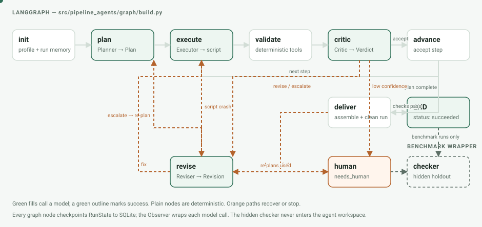

# pipeline-agents

An experiment in whether a team of specialized agents can build safer pandas and scikit-learn pipelines
than one model working alone.

The team plans, executes one step at a time, checks the files in a sandbox, revises failures, and can re-plan.
Every model call, prompt version, token, latency, validation result, and stop reason is recorded. The answer
from the experiment is useful precisely because it is not the expected one: **the single-agent baseline won
the controlled test.**



On eight held-out benchmark tasks and three seeds, the baseline succeeded **0.88** of the time, compared with
**0.50** for the team without memory. The paired difference was +0.38 [0.04, 0.71]. Giving the team all three
memory stores raised its result to **0.71**, but the +0.21 difference from no memory was not distinguishable
from noise. Costs below are *shadow prices*—token counts multiplied by a dated public price table—not money
spent; all models ran locally.

| system | success [95% CI] | model calls | shadow $ | wall time |
|---|---:|---:|---:|---:|
| one model, whole pipeline | 0.88 [0.67, 1.00] | 1.8 | 0.0016 | 153 s |
| agent team, all memories | 0.71 [0.46, 0.92] | 20.9 | 0.0093 | 363 s |
| agent team, no memory | 0.50 [0.21, 0.79] | 23.0 | 0.0097 | 373 s |

The full tables, paired comparisons, per-task outcomes, and confounds are in
[the ablation report](docs/ablations.md). On three public datasets the benchmark had never seen, both systems
passed every task (6/6 runs), including a two-million-row file; the baseline still used 8–9x fewer model calls.
See [the field test](docs/field_test.md).

## How it works



- The **Planner** turns the goal and dataset profile into ordered steps.
- The **Executor** writes and runs one step in an isolated workspace.
- Deterministic **validation tools** inspect artifacts directly: leakage, missing values and sentinels, row
  accounting, split overlap, baseline comparisons, clean reruns, and prediction smoke tests.
- The **Critic** accepts, revises, or escalates from those results. The **Reviser** specifies a repair; repeated
  failure returns to the Planner, then stops for a human rather than looping forever.
- An **Observer** saves the rendered prompt, raw response, parsed result, tokens, latency, tier, and shadow cost.
- Three separate memory stores hold procedural skills, semantic dataset facts, and episodic run summaries.

The final delivery is rerun from a clean copy, scored on a hidden holdout, and checked for the planted failure
modes. [Walk through one real 37-call run](docs/tour.md), including the rejected attempts and re-plan.

## What was measured

The benchmark has 14 tasks from seven UCI dataset families. Families—not individual rows—are split between
development and test so related tasks cannot leak across the boundary. A run succeeds only if its output:

1. runs from a clean workspace;
2. passes every applicable trap check; and
3. beats a threshold set by a reference solution on the hidden holdout.

The test comparison is 8 tasks × 3 seeds × 6 configurations: the single-agent baseline, the team without
memory, each memory alone, and all memories together. Intervals use a nested bootstrap over tasks and seeds;
differences use paired runs. Prompts and loop settings were screened on development tasks only.

This evaluation also checks its checkers. The benchmark accepted and rejected 58/58 known-good and deliberately
broken solutions. A hand audit confirmed 15/15 sampled run failures, while the model Critic agreed only weakly
with careful labels (Cohen's κ 0.30 [0.04, 0.54]). Critic decisions are therefore diagnostics, not ground truth.

Read the evidence:

- [Benchmark design and traps](docs/benchmark.md)
- [Model and serving-runtime measurements](docs/model_choice.md)
- [Held-out ablations](docs/ablations.md)
- [Failure taxonomy for 94 failed runs](docs/failure_taxonomy.md)
- [Critic and checker trust audit](docs/trust.md)
- [Fresh-data field test](docs/field_test.md)

## Run it

Requirements: Python 3.11, Linux for the full sandbox, and OpenAI-compatible local model endpoints matching
`configs/models.yaml`. The measured setup used `llama-server` and an RTX 5060 Ti with 16 GB VRAM. CPU unit
tests use scripted model responses and do not download models or call an endpoint.

```bash
python3.11 -m venv .venv
. .venv/bin/activate
pip install -e ".[dev,app]"
make check
```

Start the configured local models, then run one benchmark task:

```bash
bash scripts/serve_models.sh tiered
PYTHONPATH=src python scripts/run_task.py --task bike-2-weather --system multi
```

Use `--system baseline` for the one-model comparison. `scripts/run_grid.py` runs resumable experiment grids;
`configs/grids/` contains the exact committed configurations. Dataset downloads and hidden holdouts are built
locally and are intentionally not committed. See [the benchmark guide](docs/benchmark.md) for the build and
validation commands.

To open the Streamlit interface after the model endpoints are healthy:

```bash
make app
```

It accepts a CSV and goal, streams the plan and checks, and exposes finished-run and aggregate dashboards.

## Repository map

```text
configs/                 model, run, price, and experiment-grid settings
prompts/                 immutable, versioned prompts and their lock file
src/pipeline_agents/
  agents/                team roles and the single-agent baseline
  graph/                 LangGraph orchestration and delivery checks
  harness/               model client, prompt renderer, budget, observer
  sandbox/               isolated process runner and failure classification
  tools/                 dataset profiler and deterministic validators
  memory/                procedural, semantic, and episodic stores
  bench/                 benchmark builder, runner, checker, and field tests
  eval/                  bootstrap comparisons and trust audit
  app/                   Streamlit interface
benchmark/solutions/     references plus deliberately broken controls
outputs/                 committed summaries and generated reports
scripts/                 reproducible CLIs and document builders
tests/                   fast CPU tests with a scripted fake model
```

## Limits and next experiments

- Eight test tasks leave wide intervals; differences smaller than roughly 0.2 are unresolved.
- Seven team runs exceeded the 4 GB sandbox limit, unevenly across memory arms. They remain failures in the
  reported result.
- Two benchmark/tool defects were found after the runs and are disclosed in the report rather than silently
  recomputed away.
- The team often found a real problem but could not repair a file owned by an earlier step. A whole-pipeline
  repair path and routing memory-limit failures to the Reviser are hypotheses for a new development experiment.
- The selected models are local open weights. These numbers do not establish the same ranking for larger or
  hosted models.

The result is not that agents never help. It is narrower: in this system, on this measured task set, extra
roles and repair loops cost more and succeeded less often than letting one capable model rewrite the whole
pipeline. The stored traces make the reason inspectable instead of speculative.

## Rebuild the figures

The README figures are self-contained SVGs generated from code. The result chart reads the committed T11
summaries; its values are not copied into the drawing script.

```bash
python scripts/build_svgs.py
```
